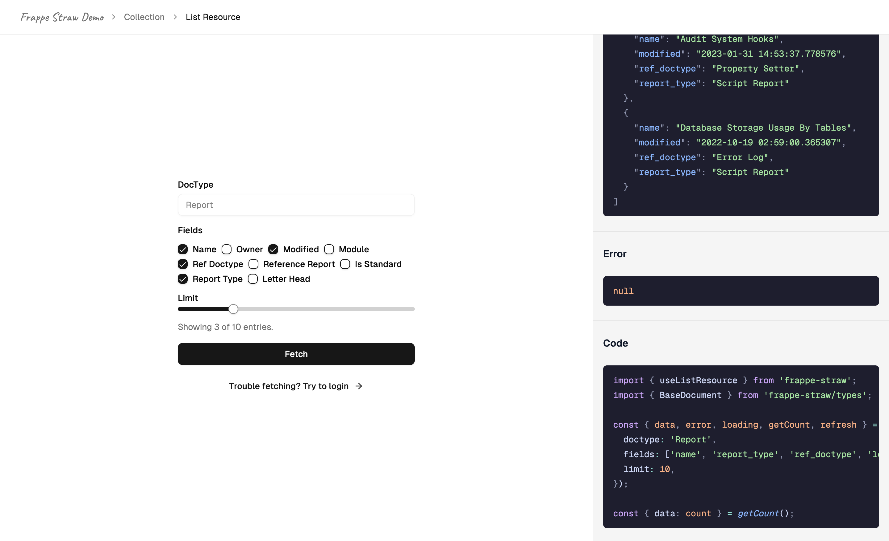

## Frappe Straw Demo

Frappe app to test and develop [Frappe Straw](https://github.com/ssiyad/frappe-straw).

### Screenshots


### Installation

You can install this app using the [bench](https://github.com/frappe/bench) CLI:

```bash
bench get-app https://github.com/ssiyad/frappe-straw-demo.git --branch develop
bench install-app frappe_straw_demo
```

You can then access the app at `https://your-site.com/straw-demo`

### Contributing

This app uses `pre-commit` for code formatting and linting. Please [install
pre-commit](https://pre-commit.com/#installation) and enable it for this
repository:

```bash
cd apps/frappe_straw_demo
pre-commit install
```

Pre-commit is configured to use the following tools for checking and formatting
your code:

- ruff
- eslint
- prettier
- pyupgrade

### License

GPL-3.0
